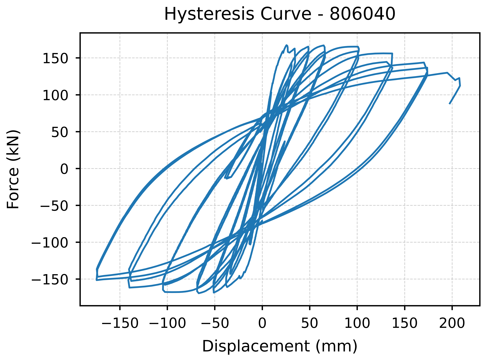

# ManualLOOP - 滞回曲线自动化处理工具

## ⚙️ 核心功能

1. **智能数据转换**  
   - 自动识别原始文本文件中的有效数据点
   - 支持科学计数法格式数据
   - 自动跳过无效数据行
   - 输出结构化CSV格式数据

2. **绘图**  


   - 600DPI高分辨率输出
   - 科研期刊要求的字体和线宽设置
   - 自适应坐标轴范围
   - 优化网格和边框样式

3. **批处理支持**  
   - 自动处理目录下所有有效文件
   - 实时进度显示

## 使用指南

### 准备工作
1. 将实验数据文件(.txt)放入`inputs/`目录
2. 文件格式要求：
   - 每行包含两个浮点数（位移和力值）
   - 支持空格或制表符分隔
   - 示例格式：
     ```
     0.0 0.0
     0.1 12.5
     0.2 25.3
     ```

### 运行程序
```bash
python main.py
```
或双击`run.bat`直接运行程序

## 输出结果
|输出类型	|位置	|格式
| --- | --- | --- |
|结构化数据	|outputs/data/	|CSV
|滞回曲线图	|outputs/plots/	|PNG

## ⚙️ 安装依赖：
```
bash
pip install pandas matplotlib tqdm
```
